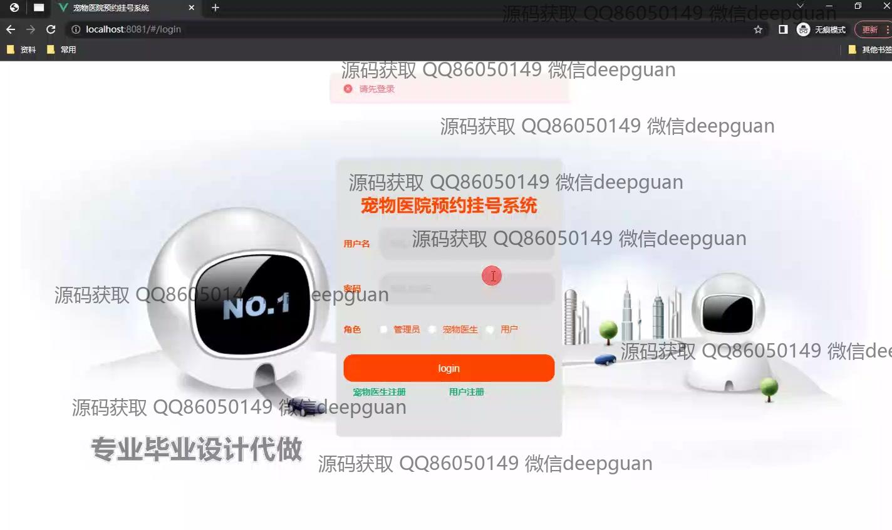
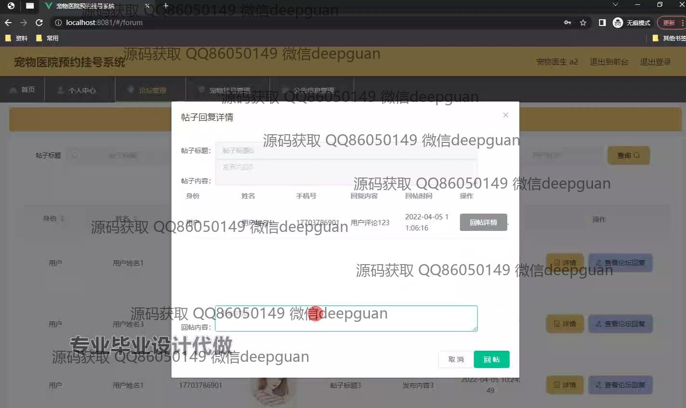

<h1 align="center">基于Java的宠物医院预约挂号系统的设计与实现+vue</h1>

## 简介
宠物医院预约挂号系统：角色分为管理员、宠物医生、用户；提供医生预约、公告管理、论坛互动、宠物信息管理、用户管理功能。    --计算机毕业设计源码；毕设源码；java毕业设计源码

## 联系方式

<h3 align="center">获取完整代码与数据库文件 + 微信：deepguan QQ: 86050149 QQ群: 783742310</h3>

<h3 align="center">可帮忙远程部署 包运行成功！提供远程部署、修改代码、设计文档指导、代码讲解等服务！</h3>

## 功能介绍（完整见运行截图）
管理员：提供用户管理、宠物医生管理、公告管理、预约管理和论坛管理功能。支持新增、修改、删除用户信息，查看用户账户余额、手机号、身份证号等；管理宠物医生的科室、职称、联系方式及挂号费用；维护公告的标题、类型、发布时间，并支持查看详情；管理预约信息，包括医生、用户、预约时间和状态；在论坛中管理帖子与回复，支持删除帖子、查看回帖详情和添加新回复。

宠物医生：登录后可管理个人预约信息，查看患者预约时间、挂号费用和联系信息；查看系统公告，了解最新动态；通过论坛参与互动，与用户讨论宠物健康问题；在个人中心查看与修改个人信息和工作时间安排。

用户：支持注册与登录，进入系统后可查看医生列表，筛选医生名称或职位进行搜索，查看医生头像、科室、职称、挂号费用等信息并完成预约；在个人中心管理预约信息和查看宠物档案；参与论坛互动，发表帖子或回复；查看系统公告和最新动态，了解医院信息。

访客：无需登录即可浏览网站首页，查看医生信息、公告信息和最新动态；在登录或注册后可访问更多功能，包括在线预约和论坛互动。

## 运行截图

本代码来源于网络,仅供学习参考使用!

